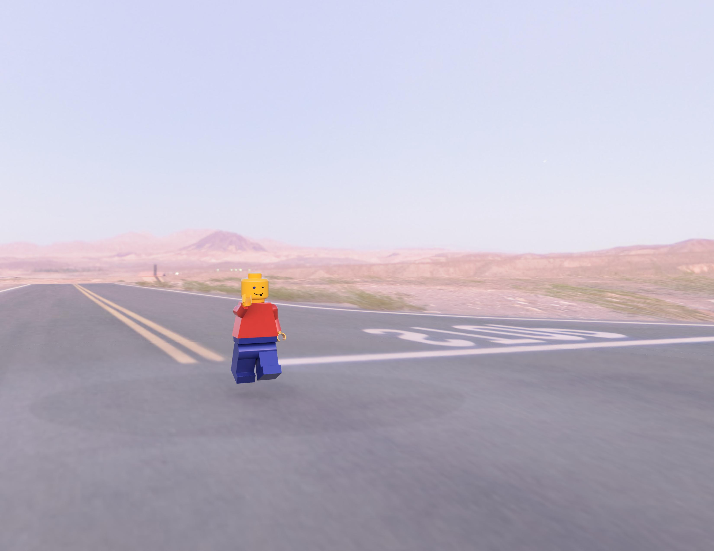

# CAD Project: Lego Minifigure

 

## 📌 Project Description
This project consists of the 3D design (CAD) of a classic Lego Minifigure. The main objective was to apply the 3D modeling and mechanical assembly knowledge acquired throughout the semester to create a complete, scaled product with fully functional joints.

Each component was modeled separately, respecting the proportions of the classic Lego system to ensure a proper fit for assembly and potential 3D printing of the final product. The project demonstrates the use of various CAD operations (Extrude, Project, Emboss, Appearance , Fillet and others) and the application of assembly constraints (Joints and Motion Studies).

## 💡 Personal Contribution & Design Quality
While the general structure and joints of the figure were modeled starting from standard Lego proportions and online inspiration sources, my main contribution and the novelty of this project is the design of the face. Instead of simply copying the usual design, I approached redesigning the facial features to my liking. I focused on detailing the face to give the minifigure a unique expression and appearance, ensuring the final product reflects my own original work and design quality. See the starry eye and the tongue that gets out of the man's mouth. 😉

## 📂 Files Used
The project is structured modularly. Below are the individually modeled components:
* `Head` - The 3D model of the head (including the top stud).
* `Torso` - The main body of the figure (the characteristic trapezoidal shape).
* `Arms` - The individual arms.
* `Hands` - The C-clip style hands.
* `Hips` - The pelvis/hips connecting the torso and the legs.
* `Legs` - The articulated legs, featuring standard base connections.
* `LegoFigure` - The final assembly that integrates and constrains all parts.

## 🎥 Video Demonstration
[🔗 Watch the video demonstration of the project here](#) 
*(Note: The link to the video demonstrating the degrees of freedom of the assembly — the rotation of the head, arms, hands, and the bending of the legs — will be added here, or the video will be embedded directly into the repository).*

## 🧩 List of Parts and Components Used
1. **Head:** Provides the figure's aesthetics and top connection; connects to the torso via a revolute joint.
2. **Torso:** The central part that supports the arms, head, and hips. It is the core of the assembly.
3. **Arms:** Provide mobility (rotation from the shoulder). Modeled independently for asymmetrical movement.
4. **Hands:** C-clip style models designed to hold standard accessories. Allowed rotation within the arm cuff.
5. **Hips:** Provide the lower skeletal structure; contain the cylindrical pins on which the independent legs rotate.
6. **Legs:** Allow the figure to stand, walk or sit.

## 🛠️ Resources Used
* **LDraw.org / Mecabricks:** Used for studying exact proportions (geometric references).
* **TurboSquid 3D Reference:** [Lego Man 3D Model Preview](https://www.turbosquid.com/FullPreview/1006239?dd_referrer=https%3A%2F%2Fwww.google.com%2F)
* **Sketchfab 3D Model:** [Lego Man by Sketchfab](https://sketchfab.com/3d-models/lego-man-5ba6a5759315437a85fac54749c46c82)
* **Blueprints / Technical Drawings:** [Drawing Database - Lego Man](https://drawingdatabase.com/lego-man/)

## ⚙️ 3D Printing Details (Optional)
If the model is to be printed, it is recommended to print the parts individually rather than in-place, using PETG or PLA material. A nozzle **smaller than 0.4mm** (e.g., 0.25mm or 0.2mm) MUST be used, along with a layer height of **0.12mm - 0.16mm**. This requirement is due to the fact that some dimensions and features on the parts are very small (< 0.4mm), making it physically impossible to print them accurately with a standard 0.4mm nozzle.